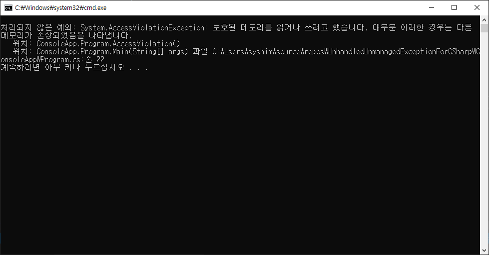

# UnhandledUnmanagedExceptionForCSharp

## ConsoleApp
- 처리되지 않는 예외 발생시 프로그램이 종료된다.
```cpp
#include "GenerateException.h"
#include <stdio.h>

void DivideZero()
{
    int a = 1 - 1;
    double b = 1 / a;
    printf("%f", b);
}

void AccessViolation()
{
    int* p = 0;
    *p = 1;
}
```
```csharp
[DllImport("UnhandledExceptionDll.Dll")]
extern public static void DivideZero();

[DllImport("UnhandledExceptionDll.Dll")]
extern public static void AccessViolation();

public static void Main(string[] args)
{
    try
    {
        AccessViolation();
    }
    catch (Exception e)
    {
        Console.WriteLine(e.ToString());
    }
    
    try
    {
        DivideZero();
    }
    catch (Exception e)
    {
        Console.WriteLine(e.ToString());
    }

   
}
```



## ConsoleApp1
- HandleProcessCorruptedStateExceptions 특성 사용
- 해당 특성이 적용된 함수 내 try~catch가 AccessViolationException을 캐치 할 수 있다.
- https://docs.microsoft.com/ko-kr/dotnet/api/system.runtime.exceptionservices.handleprocesscorruptedstateexceptionsattribute?view=netframework-4.8
- https://docs.microsoft.com/ko-kr/dotnet/api/system.accessviolationexception?view=netframework-4.7.2
```csharp

using System.Runtime.ExceptionServices;

[HandleProcessCorruptedStateExceptions]
public static void Main(string[] args)
{
   ...
}
```


## ConsoleApp2
- legacyCorruptedStateExceptionsPolicy 사용
- 모든 try~catch가 AccessViolationException을 캐치 할 수 있다.
```xml
<?xml version="1.0" encoding="utf-8" ?>
<configuration>
  <startup> 
    <supportedRuntime version="v4.0" sku=".NETFramework,Version=v4.7.2" />
  </startup>
  <runtime>
    <legacyCorruptedStateExceptionsPolicy enabled="true"/>
  </runtime>
</configuration>
```


## 결론
- AccessViolationException이 발생하는 순간 unmanaged memory heap에 생성된 자원을 해제할 방법이 없다면 memory leak이 발생한다.
- 따라서 RAII 패턴을 사용하여 메모리를 회수 할 수 있게 코딩하거나 불가능한 경우 프로그램을 재실행 하도록 시나리오를 구성 해야함
- https://stackoverflow.com/questions/3048377/how-to-free-memory-in-try-catch-blocks
