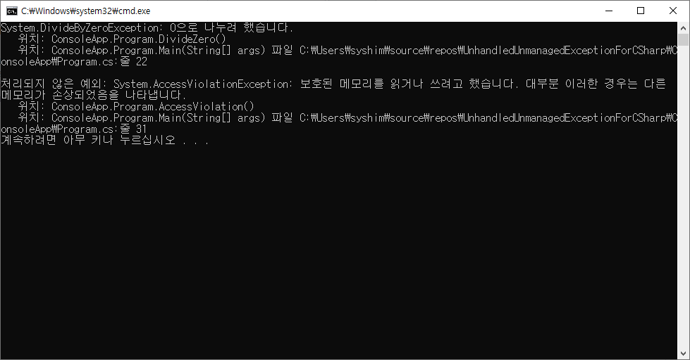

# UnhandledUnmanagedExceptionForCSharp

## Visual Studio 2019 결과
- 옵션 추가 없이 C#코드에서 C++에서 발생한 UnhandledException을 try~catch한다.
```cpp
#include "GenerateException.h"
#include <stdio.h>

void DivideZero()
{
    int a = 1 - 1;
    double b = 1 / a;
    printf("%f", b);
}

void AccessViolation()
{
    int* p = 0;
    *p = 1;
}
```
```csharp
        [DllImport("UnhandledExceptionDll.Dll")]
        extern public static void DivideZero();

        [DllImport("UnhandledExceptionDll.Dll")]
        extern public static void AccessViolation();

        public static void Main(string[] args)
        {
            try
            {
                DivideZero();
            }
            catch (Exception e)
            {
                Console.WriteLine(e.ToString());
            }

            try
            {
                AccessViolation();
            }
            catch (Exception e)
            {
                Console.WriteLine(e.ToString());
            }
        }
```



